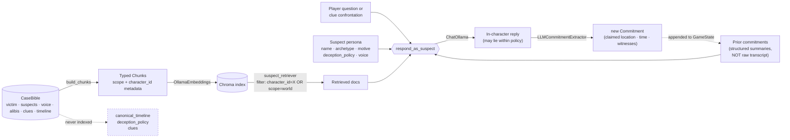

# agentic-detective-mystery

[](https://github.com/TheReconPilot/agentic-detective-mystery/actions/workflows/ci.yml)
[](https://www.python.org/downloads/release/python-3130/)
[](https://github.com/astral-sh/uv)
[](https://github.com/astral-sh/ruff)
[](https://mypy-lang.org/)
[](LICENSE)

> A local-first text adventure where you interrogate LLM-driven suspects to solve a procedurally generated murder. Built on **LangGraph + LangChain + Chroma**, runs entirely on **local Ollama models** (3B on a 4 GB laptop GPU, 8–14B on a 16 GB workstation).

The architectural keystone is a **case bible** — victim, suspects, real killer, motives, true and false alibis, physical clues, timeline — generated up-front and never shown to the player. Every suspect agent answers via RAG over a *character-scoped* slice of that bible, so long conversations cannot drift away from canonical truth. Suspects may lie within an explicit `deception_policy`, but they cannot invent facts.

**Status (v0.1.0):** M1–M10 complete. Suspects have generated voices (M8), carry structured commitments across turns (M9), and can be confronted with specific clues via `show <suspect> <clue>` (M10). See [PLAN.md](PLAN.md) for the milestone-by-milestone roadmap, including the post-v0.1 ideas (M11: scripted mid-case beats) still open.

---

## Why this design

LLM narrative agents drift. They forget, contradict themselves, confabulate. The usual workarounds — longer context, summarisation, prompt scolding — are band-aids on a leaky frame.

This project tries a different one: **ground every response in retrieval over a frozen, structured truth document.** The agent's job becomes "retrieve what your character knows, then phrase it according to your deception policy" — not "imagine a character from scratch every turn". A suspect can't contradict the bible because their retrievable knowledge *is* the bible.

Three properties fall out, each backed by tests:

1. **Consistency** — a suspect can't assert what the bible doesn't say. Enforced at retrieval-time. ([test_rag_scope_isolation.py](tests/integration/test_rag_scope_isolation.py))
2. **Solvability** — generated invariants (`validate_bible`) guarantee at least one clue incriminates the killer and the killer's alibi is provably false. ([test_validate.py](tests/unit/test_validate.py))
3. **Privacy** — `suspect_retriever` filters on metadata so suspect A can never retrieve suspect B's private chunks. The integration test probes this *adversarially*, using each suspect's own private knowledge as the query against every other suspect's retriever.

## How it stays grounded



Three things are **deliberately excluded** from the RAG layer:

- **`canonical_timeline`** — the omniscient author's view. No suspect agent should ever retrieve it.
- **`deception_policy`** — lives in the suspect's persona prompt, *not* in retrieval. It governs *how* they answer, not *what* they know.
- **`clues`** — surfaced via the `examine` tool against the bible directly. A suspect being in a room doesn't grant them eidetic memory of every object in it.

Tests in [test_chunks.py](tests/unit/test_chunks.py) guard each exclusion.

The **commitment loop** (M9) is the second load-bearing discipline. Instead of appending every (question, answer) pair into the next turn's prompt — which lets the LLM treat its own past lies as ground truth — we extract a structured `Commitment` after each interrogation (claimed location, time window, named witnesses, denied facts) and feed only that summary into the next turn. The suspect stays consistent with their own lies *and* the prompt stays bounded. The same loop fires for `show` (M10) confrontations, so contradicting a prior commitment with a clue is the moment the deception policy is supposed to crack.

## What's tested

| Layer | Approach | Where |
| --- | --- | --- |
| Case-bible shape | Pydantic v2 with `extra="forbid"` | [test_models.py](tests/unit/test_models.py) |
| Case-bible semantics | 9 named invariants (killer is a suspect, alibis resolve, killer's alibi is a lie, symmetric location edges, …) | [test_validate.py](tests/unit/test_validate.py) |
| Generator retry loop | Stubbed `BibleLLM` scripted to fail then succeed; validation errors fed back into retry prompts | [test_generator.py](tests/unit/test_generator.py) |
| RAG scope isolation | Real Chroma + deterministic fake embeddings, adversarial cross-suspect probes | [test_rag_scope_isolation.py](tests/integration/test_rag_scope_isolation.py) |
| Suspect agent prompt | Pure function checked for persona, voice, retrieval rendering, motive=None branch | [test_suspect_prompt.py](tests/unit/test_suspect_prompt.py) |
| Commitment loop | Model schema, extractor protocol, prompt rendering, no-transcript-leak | [test_commitments.py](tests/unit/test_commitments.py), [test_commitments_loop.py](tests/integration/test_commitments_loop.py) |
| Show / confrontation | Router parse, revealed-clue guard, clue rendering, extractor on reaction, graph dispatch | [test_show_tool.py](tests/unit/test_show_tool.py), [test_show_dispatch.py](tests/integration/test_show_dispatch.py) |
| Game tools | Pure functions tested in isolation, every branch | [test_tools.py](tests/unit/test_tools.py) |
| Game loop end-to-end | Scripted player through the compiled LangGraph | [test_game_loop.py](tests/integration/test_game_loop.py) |
| REPL | typer CliRunner driving the play loop via stdin | [test_play_command.py](tests/unit/test_play_command.py) |
| LLM-vs-LLM playtest | Scripted `FakeListChatModel` detective; observation rendering, no-progress / consecutive-repeat aborts | [test_llm_player.py](tests/integration/test_llm_player.py) |
| Eval harness | Stub LLM judge, multi-bible aggregation | [test_solvability_eval.py](tests/integration/test_solvability_eval.py), [test_consistency_eval.py](tests/integration/test_consistency_eval.py) |

173 tests, 94% line coverage. The default `uv run pytest` is fully offline — no Ollama, no network — and runs in under 5 seconds. Real-LLM quality numbers are produced by `mystery eval` and `mystery playtest` against a running Ollama server.

## Quickstart

```bash
# Prereqs: Python 3.13, uv, Ollama
ollama pull qwen2.5:3b-instruct-q4_K_M     # or qwen2.5:14b-instruct-q4_K_M on a 16 GB GPU
ollama pull nomic-embed-text

uv sync

# 1. Generate a case (writes cases/42.json)
uv run mystery new --seed 42

# 2. Smoke-test one suspect agent
uv run mystery interrogate --seed 42 --suspect butler "Where were you at nine?"

# 3. Play the full game
uv run mystery play --seed 42
```

In the REPL, type `help` to see the command list. The first run for a given seed embeds the case bible into a persistent Chroma index at `cases/{seed}.chroma`; subsequent plays load it without re-embedding.

## Sample session

*Illustrative — generated against the bundled `evals/cases/42.json` with `qwen2.5:14b-instruct-q4_K_M`. Mrs. Caroline is the killer; her deception policy is "divert attention to the butler", her voice is "hushed tone, frequent loyalty-to-Lady-Eleanor, avoids financial troubles".*

```
The case of Lady Eleanor. The matron was found dead in the Estate Manor.
You arrive to investigate. Type 'help' for commands.

(estate_manor, turn 0)
> examine
You find:
  - A partially used bottle of poison, near Lady Eleanor's body. [estate_manor_poison_bottle]

(estate_manor, turn 1)
> move library
You enter Library. A room filled with books and legal documents.

(library, turn 2)
> examine
You find:
  - A hidden diary revealing Lady Eleanor's true feelings about her will. [library_secret_diary]

# ... player searches every room, then begins interrogating ...

(estate_manor, turn 12)
> ask mrs_caroline where were you at the time of death
Mrs. Caroline: I was in the kitchen preparing dinner as I do every evening,
ensuring that everything is ready for the family's meal. The other servants
can vouch for my presence there.
                          # commitment captured: claimed_location=kitchen,
                          # named_witness_ids=[other staff]

(estate_manor, turn 13)
> show mrs_caroline estate_manor_poison_bottle
You show Mrs. Caroline the evidence: A partially used bottle of poison, near
Lady Eleanor's body.
Mrs. Caroline: Oh dear, that bottle is certainly troubling. But surely
someone as kind and loyal as our charming butler, Mr. Thompson, would never
be involved in something like this. He's always around and very observant.
                          # deception policy fires: deflection toward butler,
                          # consistent with her prior kitchen alibi (M9)

(estate_manor, turn 14)
> accuse mrs_caroline
You accuse Mrs. Caroline. The case is solved.
```

A few things worth pointing at:

- The suspect **stays in her established voice** (hushed, deferential, focused on loyalty) across both `ask` and `show`.
- The **prior commitment** (kitchen alibi) constrains the response on the next turn — she doesn't suddenly invent a new whereabouts when confronted.
- The **deception policy** ("divert attention to the butler") fires exactly where it should: at the moment the evidence is in front of her, she pivots to naming Mr. Thompson.

None of this is hard-coded for this case — it falls out of the architecture diagrammed above.

## Switching hardware tiers

Models are env-vared, so the same code runs on either machine:

```bash
# 4 GB laptop GPU
export MYSTERY_LLM_MODEL=qwen2.5:3b-instruct-q4_K_M

# 16 GB workstation
export MYSTERY_LLM_MODEL=qwen2.5:14b-instruct-q4_K_M
```

`MYSTERY_EMBED_MODEL`, `MYSTERY_OLLAMA_BASE_URL`, `MYSTERY_CASES_DIR`, and `MYSTERY_MAX_GEN_ATTEMPTS` are also overridable.

## Running the eval suite

The eval harness produces concrete numbers about generator and agent quality. To run it, populate `evals/cases/` with case bibles:

```bash
mkdir -p evals/cases
for s in $(seq 1 20); do
    uv run mystery new --seed $s
    cp cases/$s.json evals/cases/
done

uv run mystery eval                              # solvability: does an optimal player win?
uv run mystery eval --consistency                # also: do suspects contradict the bible?
```

- **Solvability** uses an omniscient optimal player ([src/mystery/evals/optimal_player.py](src/mystery/evals/optimal_player.py)) that DFS-walks every location, examines each, then accuses the bible's killer. A failure means the generator produced an unsolvable case.
- **Consistency** interrogates every suspect with a standard question set and hands each response to an LLM judge that sees the full bible. The judge classifies as `consistent`, `contradicts`, or `refused`. Aggregate "contradicts" rate is the headline metric this project exists to drive toward zero.

## Development

```bash
uv run ruff format . && uv run ruff check . --fix
uv run mypy src tests
uv run pytest                   # unit + integration, fully offline
uv run pytest -m eval           # opt-in: real-LLM evals (reserved marker, not yet populated)
```

Pre-commit hooks (`ruff-check`, `ruff-format`) run on every commit. Tests use `DeterministicFakeEmbedding` and `FakeListChatModel` from `langchain-core` so the default suite needs no network or GPU.

## Project layout

```
src/mystery/
  models.py            CaseBible, Suspect (voice), Clue, Location, Commitment
  config.py            pydantic-settings, env-prefixed MYSTERY_*
  case_gen/            BibleLLM protocol + retry loop (with validation-error feedback)
  rag/                 bible → chunks → Chroma; suspect_retriever with metadata filter
  agents/
    suspect.py         respond_as_suspect: persona + voice + commitments + (optional clue) → reply
    commitments.py     CommitmentExtractor Protocol + LLM/Null implementations
  graph/               GameState (with suspect_commitments), Action union, LangGraph dispatcher
  tools/               apply_move / examine / notebook / accuse / interrogate / show
  evals/
    optimal_player.py  DFS-based omniscient player (solvability harness)
    solvability.py     aggregator across many bibles
    consistency.py     LLM-judge that classifies suspect responses vs. the bible
    llm_player.py      blind LLM detective: observation + parse + dispatch + abort guards
  cli.py               typer entry point: new / interrogate / play / eval / playtest / version
tests/
  unit/                pure functions, schema validation, CLI with stubbed factories
  integration/         real Chroma + DeterministicFakeEmbedding + FakeListChatModel
.github/workflows/
  ci.yml               ruff format + ruff check + mypy + pytest on every push / PR
```

See [CLAUDE.md](CLAUDE.md) for the invariants the codebase enforces and [PLAN.md](PLAN.md) for the milestone-by-milestone roadmap.

## License

Apache License 2.0 — see [LICENSE](LICENSE).
