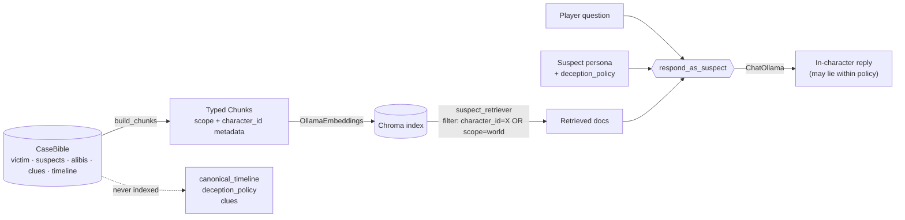

# agentic-detective-mystery

> A local-first text adventure where you interrogate LLM-driven suspects to solve a procedurally generated murder. Built on **LangGraph + LangChain + Chroma**, runs entirely on **local Ollama models** (3B on a 4 GB laptop GPU, 8–14B on a 16 GB workstation).

The architectural keystone is a **case bible** — victim, suspects, real killer, motives, true and false alibis, physical clues, timeline — generated up-front and never shown to the player. Every suspect agent answers via RAG over a *character-scoped* slice of that bible, so long conversations cannot drift away from canonical truth. Suspects may lie within an explicit `deception_policy`, but they cannot invent facts.

**Status:** M1–M6 complete (schemas, generator, RAG, suspect agent, full playable game loop, eval harness). M7 polish in progress. See [PLAN.md](PLAN.md) for the roadmap.

---

## Why this design

LLM narrative agents drift. They forget, contradict themselves, confabulate. The usual workarounds — longer context, summarisation, prompt scolding — are band-aids on a leaky frame.

This project tries a different one: **ground every response in retrieval over a frozen, structured truth document.** The agent's job becomes "retrieve what your character knows, then phrase it according to your deception policy" — not "imagine a character from scratch every turn". A suspect can't contradict the bible because their retrievable knowledge *is* the bible.

Three properties fall out, each backed by tests:

1. **Consistency** — a suspect can't assert what the bible doesn't say. Enforced at retrieval-time. ([test_rag_scope_isolation.py](tests/integration/test_rag_scope_isolation.py))
2. **Solvability** — generated invariants (`validate_bible`) guarantee at least one clue incriminates the killer and the killer's alibi is provably false. ([test_validate.py](tests/unit/test_validate.py))
3. **Privacy** — `suspect_retriever` filters on metadata so suspect A can never retrieve suspect B's private chunks. The integration test probes this *adversarially*, using each suspect's own private knowledge as the query against every other suspect's retriever.

## How it stays grounded



Three things are **deliberately excluded** from the RAG layer:

- **`canonical_timeline`** — the omniscient author's view. No suspect agent should ever retrieve it.
- **`deception_policy`** — lives in the suspect's persona prompt, *not* in retrieval. It governs *how* they answer, not *what* they know.
- **`clues`** — surfaced via the `examine` tool against the bible directly. A suspect being in a room doesn't grant them eidetic memory of every object in it.

Tests in [test_chunks.py](tests/unit/test_chunks.py) guard each exclusion.

## What's tested

| Layer | Approach | Where |
| --- | --- | --- |
| Case-bible shape | Pydantic v2 with `extra="forbid"` | [test_models.py](tests/unit/test_models.py) |
| Case-bible semantics | 8 named invariants (killer is a suspect, alibis resolve, killer's alibi is a lie, …) | [test_validate.py](tests/unit/test_validate.py) |
| Generator retry loop | Stubbed `BibleLLM` scripted to fail then succeed | [test_generator.py](tests/unit/test_generator.py) |
| RAG scope isolation | Real Chroma + deterministic fake embeddings, adversarial cross-suspect probes | [test_rag_scope_isolation.py](tests/integration/test_rag_scope_isolation.py) |
| Suspect agent prompt | Pure function checked for persona inclusion, retrieval rendering, motive=None branch | [test_suspect_prompt.py](tests/unit/test_suspect_prompt.py) |
| Game tools | Pure functions tested in isolation, every branch | [test_tools.py](tests/unit/test_tools.py) |
| Game loop end-to-end | Scripted player through the compiled LangGraph | [test_game_loop.py](tests/integration/test_game_loop.py) |
| REPL | typer CliRunner driving the play loop via stdin | [test_play_command.py](tests/unit/test_play_command.py) |
| Eval harness | Stub LLM judge, multi-bible aggregation | [test_solvability_eval.py](tests/integration/test_solvability_eval.py), [test_consistency_eval.py](tests/integration/test_consistency_eval.py) |

107 tests, 96% line coverage at the time of writing. The default `uv run pytest` is fully offline — no Ollama, no network — and runs in under 10 seconds. Real-LLM quality numbers are produced by `mystery eval` against a running Ollama server.

## Quickstart

```bash
# Prereqs: Python 3.13, uv, Ollama
ollama pull qwen2.5:3b-instruct-q4_K_M     # or qwen2.5:14b-instruct-q4_K_M on a 16 GB GPU
ollama pull nomic-embed-text

uv sync

# 1. Generate a case (writes cases/42.json)
uv run mystery new --seed 42

# 2. Smoke-test one suspect agent
uv run mystery interrogate --seed 42 --suspect butler "Where were you at nine?"

# 3. Play the full game
uv run mystery play --seed 42
```

In the REPL, type `help` to see the command list. The first run for a given seed embeds the case bible into a persistent Chroma index at `cases/{seed}.chroma`; subsequent plays load it without re-embedding.

## Sample session

*Illustrative output from the bundled test bible (Lord Ashworth, killed in the library):*

```
The case of Lord Ashworth. The host of the dinner party was found dead in the
Library. You arrive to investigate. Type 'help' for commands.

(library, turn 0)
> examine
You find:
  - A torn letter mentioning a disinheritance. [torn_letter]

(library, turn 1)
> move hallway
You enter the Hallway. A long marble corridor.

(hallway, turn 2)
> examine
You find:
  - A pair of muddy boots tucked behind the umbrella stand. [muddy_boots]

(hallway, turn 3)
> ask butler Where were you when the clock struck nine?
Mr. Hodges: I was in the garden taking the night air, sir. I saw nothing.

(hallway, turn 4)
> notes
Your notebook:
  VICTIM: Lord Ashworth (host of the dinner party) — found in library at t=60.
  [torn_letter] A torn letter mentioning a disinheritance.
  [muddy_boots] A pair of muddy boots tucked behind the umbrella stand.

(hallway, turn 4)
> accuse butler
You accuse Mr. Hodges. After a long pause, they confess.
The case is solved in 5 turns.
```

## Switching hardware tiers

Models are env-vared, so the same code runs on either machine:

```bash
# 4 GB laptop GPU
export MYSTERY_LLM_MODEL=qwen2.5:3b-instruct-q4_K_M

# 16 GB workstation
export MYSTERY_LLM_MODEL=qwen2.5:14b-instruct-q4_K_M
```

`MYSTERY_EMBED_MODEL`, `MYSTERY_OLLAMA_BASE_URL`, `MYSTERY_CASES_DIR`, and `MYSTERY_MAX_GEN_ATTEMPTS` are also overridable.

## Running the eval suite

The eval harness produces concrete numbers about generator and agent quality. To run it, populate `evals/cases/` with case bibles:

```bash
mkdir -p evals/cases
for s in $(seq 1 20); do
    uv run mystery new --seed $s
    cp cases/$s.json evals/cases/
done

uv run mystery eval                              # solvability: does an optimal player win?
uv run mystery eval --consistency                # also: do suspects contradict the bible?
```

- **Solvability** uses an omniscient optimal player ([src/mystery/evals/optimal_player.py](src/mystery/evals/optimal_player.py)) that DFS-walks every location, examines each, then accuses the bible's killer. A failure means the generator produced an unsolvable case.
- **Consistency** interrogates every suspect with a standard question set and hands each response to an LLM judge that sees the full bible. The judge classifies as `consistent`, `contradicts`, or `refused`. Aggregate "contradicts" rate is the headline metric this project exists to drive toward zero.

## Development

```bash
uv run ruff format . && uv run ruff check . --fix
uv run mypy src tests
uv run pytest                   # unit + integration, fully offline
uv run pytest -m eval           # opt-in: real-LLM evals (reserved marker, not yet populated)
```

Pre-commit hooks (`ruff-check`, `ruff-format`) run on every commit. Tests use `DeterministicFakeEmbedding` and `FakeListChatModel` from `langchain-core` so the default suite needs no network or GPU.

## Project layout

```
src/mystery/
  models.py        CaseBible, Suspect, Clue, Location (pydantic v2, extras forbidden)
  config.py        pydantic-settings, env-prefixed MYSTERY_*
  case_gen/        BibleLLM protocol + retry loop + Ollama-backed structured-output impl
  rag/             bible → chunks → Chroma; suspect_retriever with metadata scope filter
  agents/          respond_as_suspect: retrieve → render persona → chat → string
  graph/           GameState, action parser, LangGraph dispatcher
  tools/           pure state-update functions (move / examine / notebook / accuse / interrogate)
  evals/           optimal player, solvability aggregator, consistency judge
  cli.py           typer entry point (new, interrogate, play, eval, version)
tests/
  unit/            pure functions, schema validation, CLI with stubbed factories
  integration/     real Chroma + DeterministicFakeEmbedding + FakeListChatModel
```

See [CLAUDE.md](CLAUDE.md) for the invariants the codebase enforces and [PLAN.md](PLAN.md) for the milestone-by-milestone roadmap.

## License

Apache License 2.0 — see [LICENSE](LICENSE).
